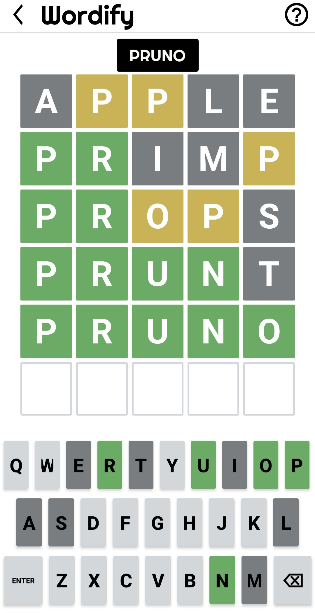

<p align="center">
  
</p>

<h1 align="center">Wordify</h1>

<p align="center">
  <strong>A polished Android word puzzle game for daily challenges and unlimited five-letter practice.</strong>
</p>

<p align="center">
  Guess the hidden word, learn from color-coded feedback, track your streaks, and keep your progress saved locally across sessions.
</p>

<p align="center">
  
  
  
  
  
</p>

---

## Overview

Wordify is a Kotlin-based Android word puzzle game inspired by classic five-letter guessing games. Players solve the hidden word through color-coded feedback, track progress across sessions, and choose between a daily challenge or unlimited practice mode.

<p align="center">
  
</p>

## Features

- Daily word mode with a 24-hour cooldown after each completed puzzle
- Unlimited mode for continuous five-letter word practice
- Color-coded tile and keyboard feedback for correct, misplaced, and absent letters
- Local word validation using the bundled asset word list
- Guest play, registration, login, and saved user sessions
- Player profile with games played, wins, current streak, and best streak
- Persistent game state, keyboard state, and per-user statistics
- Help, settings, privacy policy, terms, developer, and bug report screens
- Light, dark, and high-contrast visual support

## Tech Stack

- Kotlin
- Android SDK
- Gradle Kotlin DSL
- AndroidX AppCompat
- Material Components
- ConstraintLayout
- Jetpack Compose dependencies
- SharedPreferences for local user, game, and statistics storage

## Requirements

- Android Studio or a local Android SDK installation
- JDK 17 or a version supported by your installed Android Gradle Plugin
- Android device or emulator running Android 7.0 or newer

## Getting Started

Clone the repository:

```bash
git clone https://github.com/jojseph/Wodify.git
cd Wodify
```

Open the project in Android Studio, let Gradle sync, then run the `app` configuration on an emulator or connected Android device.

You can also build from the command line:

```bash
./gradlew assembleDebug
```

On Windows PowerShell:

```powershell
.\gradlew.bat assembleDebug
```

The debug APK will be generated under:

```text
app/build/outputs/apk/debug/
```

## Project Structure

```text
app/src/main/java/com/android/wordify/   Kotlin activities and game logic
app/src/main/res/layout/                 XML screens and dialogs
app/src/main/res/drawable/               Game artwork, icons, and UI backgrounds
app/src/main/res/values/                 Colors, themes, and strings
app/src/main/assets/data.txt             Five-letter word list
docs/images/                             Repository screenshots
```

## Core Gameplay

Wordify gives players six attempts to discover a hidden five-letter word. Each guess updates the board and keyboard:

- Green means the letter is correct and in the correct position
- Yellow means the letter is in the word but in a different position
- Gray means the letter is not in the word

Daily mode saves progress and limits completed puzzles until the next cooldown reset. Unlimited mode lets players keep solving new words without waiting.

## Local Data

Wordify stores user accounts, login state, gameplay progress, keyboard state, and statistics locally with SharedPreferences. The app does not require a remote database to run.

## Testing

Run the included unit and Android test tasks with Gradle:

```bash
./gradlew test
./gradlew connectedAndroidTest
```

`connectedAndroidTest` requires a running emulator or connected Android device.

## Repository Status

The latest development branch is `finals`, and `main` has been updated locally to point to the same commit. Future repository updates should generally target `main`.
